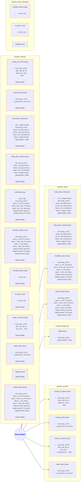

```mermaid
flowchart LR
    classDef pass stroke:#66bb6a
    classDef warn stroke:#ffa726
    classDef fail stroke:#f44336
    s0(("<strong><a href="https://cosmos.epic.com/" target="_blank" rel="noreferrer">Epic Cosmos</a></strong>"))
    subgraph bundle_cosmos["`bundle_cosmos`"]
        direction LR
        n1["`county_no_time.csv.gz<br/><br/><ul><li><code>missing_info: bmi_30_49.8, obesity_(%), Year</code></li></ul><br />Script Failed:<br />`"]:::fail
        n2["`county_year.csv.gz<br/><br/><ul><li><code>missing_info: n_patients_chronic</code></li></ul><br />Script Failed:<br />`"]:::fail
        n3["`heat_year_county.csv<br/><br/><ul><li><code>not_compressed</code></li><li><code>missing_info: heat_ed_patients, total_ed_patients, heat_ed_incidence, heat_suppressed, geography_name</code></li></ul><br />Script Failed:<br />`"]:::fail
        n4["`heat_year_county.csv.gz<br/><br/><ul><li><code>missing_info: heat_ed_patients, total_ed_patients, heat_ed_incidence, heat_suppressed, geography_name</code></li></ul><br />Script Failed:<br />`"]:::fail
        n5["`monthly.csv.gz<br/><br/><ul><li><code>time_nas</code></li><li><code>missing_info: epic_n_ed_firearm, epic_pct_ed_firearm, epic_pct_ed_opioid, suppressed_opioid, suppressed_firearm</code></li></ul><br />Script Failed:<br />`"]:::fail
        n6["`monthly_injury.csv.gz<br/><br/><ul><li><code>missing_info: epic_n_ed_firearm, epic_rate_ed_firearm, epic_n_ed_heat, epic_rate_ed_heat, suppressed_opioid, suppressed_firearm, suppressed_heat</code></li></ul><br />Script Failed:<br />`"]:::fail
        n7["`monthly_tests.csv.gz<br/><br/><ul><li><code>time_nas</code></li></ul><br />Script Failed:<br />`"]:::fail
        n8["`no_geo.csv.gz<br/><br/><ul><li><code>time_nas</code></li></ul><br />Script Failed:<br />`"]:::fail
        n9["`state_no_time.csv.gz<br/><br/><ul><li><code>missing_info: bmi_30_49.8, dm_(%), Year</code></li></ul><br />Script Failed:<br />`"]:::fail
        n10["`state_year.csv.gz<br/><br/><ul><li><code>missing_info: n_patients_chronic</code></li></ul><br />Script Failed:<br />`"]:::fail
        n11["`weekly.csv.gz<br /><br />Script Failed:<br />`"]:::fail
        n12["`yearly_injury.csv.gz<br/><br/><ul><li><code>missing_info: epic_n_ed_firearm, epic_rate_ed_firearm, epic_n_ed_heat, epic_rate_ed_heat, suppressed_opioid, suppressed_firearm, suppressed_heat</code></li></ul><br />Script Failed:<br />`"]:::fail
    end
    subgraph cosmos_chronic["`cosmos_chronic`"]
        direction LR
        n13["`county_no_time.csv.gz<br/><br/><ul><li><code>missing_info: bmi_30_49.8, obesity_(%), Year</code></li></ul>`"]:::warn
        n14["`county_year.csv.gz<br/><br/><ul><li><code>missing_info: n_patients_chronic</code></li></ul>`"]:::warn
        n15["`state_no_time.csv.gz<br/><br/><ul><li><code>missing_info: bmi_30_49.8, dm_(%), n_patients, Year</code></li></ul>`"]:::warn
        n16["`state_year.csv.gz<br/><br/><ul><li><code>missing_info: n_patients_chronic</code></li></ul>`"]:::warn
    end
    subgraph cosmos_hepb_vax["`cosmos_hepb_vax`"]
        direction LR
        n17["`data.csv.gz<br/><br/><ul><li><code>missing_info: suppressed_flag</code></li></ul>`"]:::warn
    end
    subgraph cosmos_injury["`cosmos_injury`"]
        direction LR
        n18["`heat_year_county.csv<br/><br/><ul><li><code>not_compressed</code></li><li><code>missing_info: heat_ed_patients, total_ed_patients, heat_ed_incidence, heat_suppressed, geography_name</code></li></ul>`"]:::warn
        n19["`heat_year_county.csv.gz<br/><br/><ul><li><code>missing_info: heat_ed_patients, total_ed_patients, heat_ed_incidence, heat_suppressed, geography_name</code></li></ul>`"]:::warn
        n20["`monthly_injury.csv.gz<br/><br/><ul><li><code>missing_info: epic_n_ed_firearm, epic_rate_ed_firearm, epic_n_ed_heat, epic_rate_ed_heat, suppressed_opioid, suppressed_firearm, suppressed_heat</code></li></ul>`"]:::warn
        n21["`yearly_injury.csv.gz<br/><br/><ul><li><code>missing_info: epic_n_ed_firearm, epic_rate_ed_firearm, epic_n_ed_heat, epic_rate_ed_heat, suppressed_opioid, suppressed_firearm, suppressed_heat</code></li></ul>`"]:::warn
    end
    subgraph cosmos_resp_infections["`cosmos_resp_infections`"]
        direction LR
        n22["`monthly_tests.csv.gz<br/><br/><ul><li><code>time_nas</code></li></ul>`"]:::warn
        n23["`no_geo.csv.gz<br/><br/><ul><li><code>time_nas</code></li></ul>`"]:::warn
        n24["`weekly.csv.gz`"]:::pass
    end
    s0 --> n13
    s0 --> n14
    s0 --> n15
    s0 --> n16
    s0 --> n17
    s0 --> n20
    s0 --> n21
```
